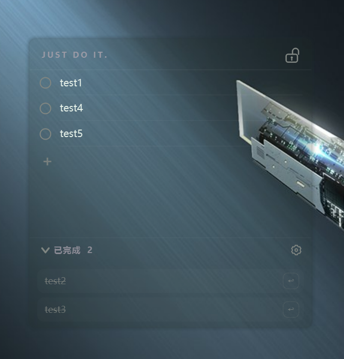
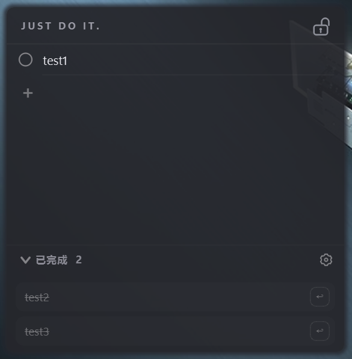
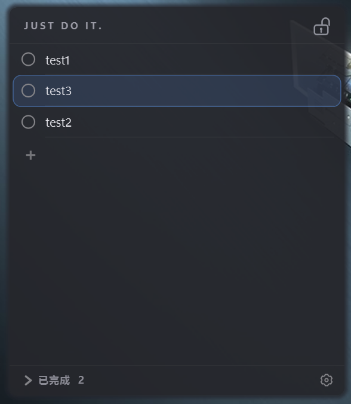
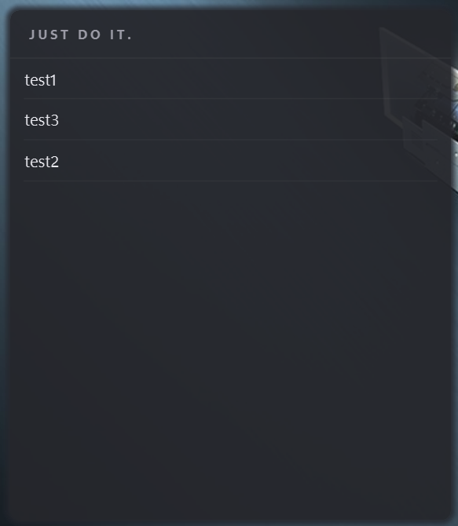
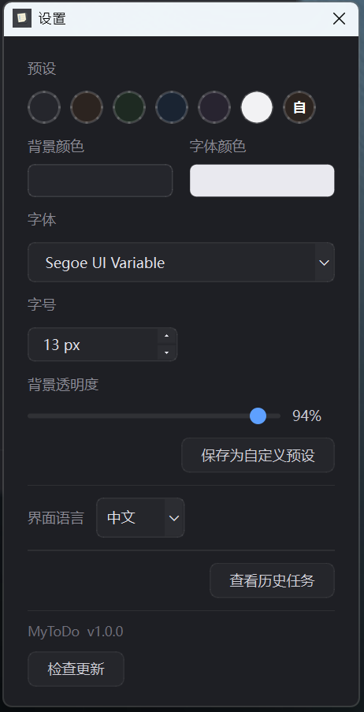
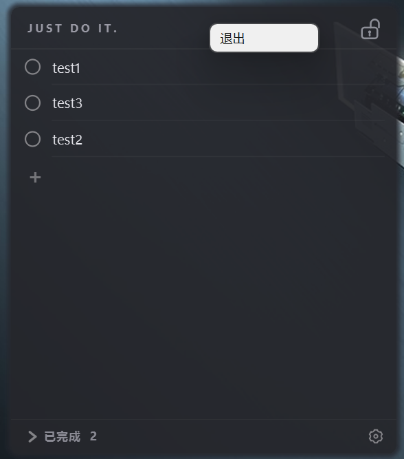

# MyToDo —— 桌面任务便签

一个本地运行的 Windows 桌面任务便签软件,半透明无边框地显示在桌面上,能看到壁纸,类似精简版 Microsoft To Do。

**🌐 官网**：https://jinmyyang.github.io/MyToDo/

**⬇️ [下载 Windows 版](https://github.com/JinmyYang/MyToDo/releases/latest)**（进入发布页后下载 `MyToDo-Setup-v*.exe` 安装包，按向导安装）

## 功能

一个能自定义背景颜色、透明度、字体等外观的简约风格 todo 软件：任务新建、完成、拖拽排序、锁定窗口、历史记录都在一块半透明的桌面便签上完成，数据全部保存在本地。

| 低透明度下能看到壁纸 | 已完成栏可展开、恢复任务 |
|:---:|:---:|
|  |  |
| **长按任务可拖动调整顺序** | **锁定后很简约，移入鼠标点右上角锁头解锁** |
|  |  |
| **设置界面，可自定义外观** | **右键顶部栏可退出程序** |
|  |  |

## 安装

需要 Python 3.10+(在 3.13 上开发)。

```bash
python -m pip install -r requirements.txt
```

## 运行

```bash
python main.py
```

首次运行会在 `%APPDATA%\MyToDo\tasks.json` 创建数据文件（旧便携版 `.sticky_tasks` 里的数据会自动迁入）。

## 使用

1. [下载 Windows 版](https://github.com/JinmyYang/MyToDo/releases/latest) 的 `MyToDo-Setup-v*.exe` 安装包
2. 双击安装包按向导安装（仅当前用户，不需要管理员权限）
3. 从开始菜单或桌面快捷方式启动，任务数据保存在 `%APPDATA%\MyToDo`
4. 软件内「设置 → 检查更新」可一键更新；卸载走「设置 → 应用」，卸载时可选是否删除数据

## 测试

```bash
# 全部测试(数据层单测 + GUI 冒烟)
python -m pytest tests/ -v

# 仅数据层
python -m pytest tests/test_task_store.py -v

# GUI 冒烟(无界面,不弹窗)
QT_QPA_PLATFORM=offscreen python -m pytest tests/test_gui_smoke.py -v
```

测试覆盖数据持久化、损坏文件恢复、外观设置以及主要 GUI 交互流程。

## 技术栈

- **Python 3.13** + **PySide6 6.11**(Qt for Python)
- 数据持久化:JSON(`%APPDATA%\MyToDo\tasks.json`)
- 安装器:Inno Setup 6(`mytodo.iss`)
- 测试:pytest

## 目录结构

```
project0711/
├── main.py                  # 入口
├── requirements.txt
├── assets/
│   └── icon.ico             # 应用图标
├── installer/
│   └── ChineseSimplified.isl # 安装向导简体中文语言包
├── mytodo.iss               # Inno Setup 安装脚本
├── sticky_tasks/
│   ├── app_paths.py         # 数据/日志等路径解析
│   ├── task_store.py        # 数据层(Task / TaskStore)
│   ├── json_io.py           # 原子文件写入
│   ├── app_settings.py      # 外观设置模型与主题派生
│   ├── updater.py           # 检查更新(GitHub Releases API)
│   ├── task_item.py         # 任务项 widget(圆点 + 可编辑文本)
│   ├── completed_panel.py   # 已完成面板
│   ├── history_window.py    # 历史任务批量管理窗口
│   ├── settings_dialog.py   # 外观设置窗口
│   └── main_window.py       # 主窗口(半透明/无边框/拖动/缩放)
└── tests/
    ├── test_app_settings.py # 外观设置测试
    ├── test_task_store.py   # 数据层单测
    ├── test_updater.py      # 检查更新测试
    └── test_gui_smoke.py    # GUI 冒烟测试
```

## 设计要点

- **数据与 UI 分离**:`TaskStore` 不依赖 Qt,可单独测试;UI 只在交互时调用 store。
- **半透明 + 圆角**:窗口 `WA_TranslucentBackground` + 容器 `rgba` 背景,文字保持不透明清晰;圆角外区域透明。
- **拖动**:无边框窗口重写鼠标事件,点标题栏空白处拖动。
- **空任务自清理**:新建留空的任务在失焦/完成时删除,避免空行堆积。
